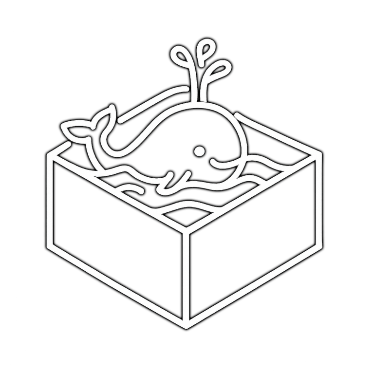

<p align="center">
  
</p>
<h2 align="center">
  claudeway - The Ultimate Defense: Securing Claude Code Execution
</h2>

----

A CLI tool for safely running AI agents including Claude Code inside Docker containers.

## Installation

```bash
go install github.com/mohemohe/claudeway@latest
```

## Usage

### Initial Setup

```bash
# Initialize global configuration and Docker assets
claudeway init --global

# Initialize project-specific configuration
claudeway init
```

### Basic Usage

```bash
# Start container and enter interactive shell
claudeway up

# Enter interactive shell of already running container
claudeway exec

# Stop and remove container
claudeway down
```

### Other Commands

```bash
# Build Docker image
claudeway image build

# Build image without cache
claudeway image build --no-cache
```

## Configuration File

`claudeway.yaml` format:

```yaml
# Volume mount settings
bind:
  - /var/run/docker.sock:/var/run/docker.sock  # Docker socket
  - ~/.claude.json:~/.claude.json               # Claude configuration
  - ~/.claude:~/.claude                         # Claude directory

# Files to copy into container
copy:
  - ~/.gitconfig                                 # Git configuration
  - ~/.ssh                                       # SSH keys

# Initialization commands (executed on container startup)
init:
  - curl -Ls get.docker.com | sh                # Install Docker
  - asdf plugin add nodejs                       # Add Node.js plugin
  - asdf install nodejs 22.17.0                  # Install Node.js
  - asdf global nodejs 22.17.0                   # Set default version
  - npm i -g @anthropic-ai/claude-code          # Install Claude Code
```
